# Perception for ML-Agents (v0.1)

生成CV领域的ground truth数据, 包括(Bounding Box, 语义分割图, 深度图), 并集成ML-Agents, 作为智能体的观测数据用于强化学习的训练. 

集成的Python端示例代码可在此获取: [Perception-for-ML-Agents-Sample](https://github.com/BlueFisher/Perception-for-ML-Agents-Sample)

# 特点

**Perception**为[Unity ML-Agents](https://docs.unity3d.com/Packages/com.unity.ml-agents@4.0/manual/index.html)提供ground truth的CV数据. 
允许标准的Unity相机生成丰富的Ground Truth数据, 包括Bounding Box, 语义分割图, 深度图. 

Perception集成Unity ML-Agents. 
封装这些ground truth生成器为自定义的传感器组件, 使强化学习智能体能够直接观察ground truth. 
观测数据会被序列化并通过ML-Agents API发送到外部Python环境, 从而实现复杂的基于视觉的强化学习模型训练. 

Perception是已弃用的com.unity.perception的分支. 
剥离了数据集捕获(离线数据收集)功能, 专注于轻量级的实时ground truth生成, 并支持**Unity 6**. 

# 安装

在使用的`Universal Render Pipline Asset`的`Rendering -> Renderer List`中添加`PerceptionRenderer`. 

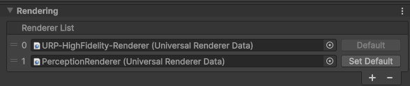

确保项目中已经安装了`com.unity.ml-agents>=4.0.0`插件. [安装指南](https://docs.unity3d.com/Packages/com.unity.ml-agents@4.0/manual/Installation.html#install-ml-agents-package-installation)


# 使用方法

## 增加标签配置

在`Project`面板中, `Create -> Perception -> ID Label Config`创建一个新的ID标签配置文件. 

可以指定任意的标签名字. 建议将`Auto Assign IDs`选项打开, `Starting ID`设置为0. 因为BoundingBox的物体类别信息是onehot类型, 所以ID需要从0开始连续编号. 

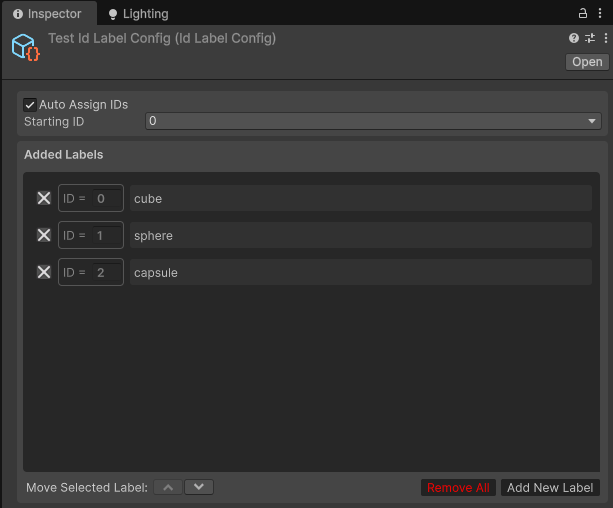

`Create -> Perception -> Semantic Segmentation Label Config`创建一个新语义分割标签配置文件. 

同样可以指定任意标签名字, 并设置任意的语义分割后的颜色. 

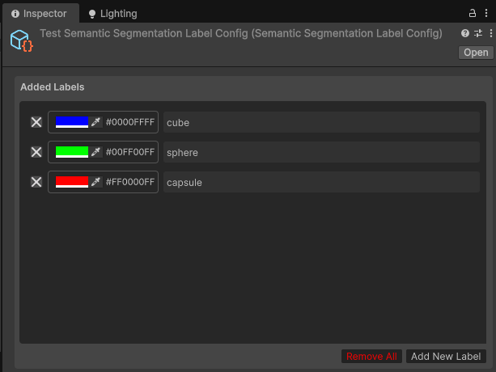

## 为GameObject添加标签

为需要进行感知标注的GameObject添加`Labeling`组件。
点击`Add New Label`并输入在`ID Label Config`中设置的标签名称。

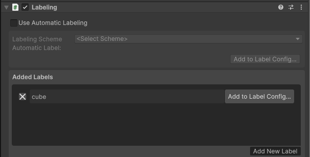


## 使用Perception Camera

将使用Perception功能的Camera的`Rendering -> Renderer`设置为`PerceptionRenderer`. 

注意调整`Projection -> Clipping Planes`的`Near`和`Far`值, 以确保深度图的范围. 

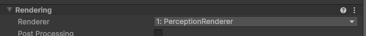

根据需要添加具体的`Perception Camera`组件, 可以在同一个Camera上添加多个. 


### `Bounding Box Perception Camera`

用于生成BoundingBox, 底层是使用`Instance Segmentatation`实现的, 所以需要ID标签配置文件. 

配置参数:
*   `Enable Manually Capture`: 是否手动调用Capture方法进行捕获, 默认每帧自动捕获. ML-Agents的组件中使用, 通常不需要手动捕获, 设置为默认`false`即可. 
*   `Test Raw Image`: 是否在Canvas的`Raw Image`中显示原始的Instance Segmentation图像, 调试或可视化展示用. 显示的Instance Segmentation图像会给每个物体分配唯一的颜色, 但不是ML-Agents的观测数据, 仅供参考. 
*   `Id Label Config`: ID标签配置文件. 
*   `Semantic Segmentation Label Config`: 语义分割标签配置文件, 会在`boundingBoxInfos`中分配对应的标签所对应的语义分割颜色. 

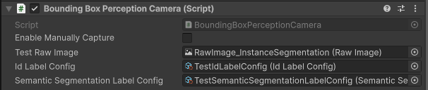


### `Semantic Segmentation Perception Camera`

用于生成语义分割图像, 底层是使用`Semantic Segmentation`实现的, 所以需要语义分割标签配置文件. 

配置参数:
*   `Enable Manually Capture`: 是否手动调用Capture方法进行捕获, 默认每帧自动捕获. ML-Agents的组件中使用, 通常不需要手动捕获, 设置为默认`false`即可. 
*   `Test Raw Image`: 是否在Canvas的`Raw Image`中显示Semantic Segmentation, 与传递给ML-Agents的观测数据相同. 
*   `Semantic Segmentation Label Config`: 语义分割标签配置文件, 会在`boundingBoxInfos`中分配对应的标签所对应的语义分割颜色. 

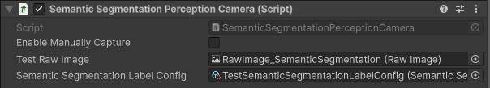


### `Depth Render Perception Camera`

用于生成深度图像. 

配置参数:
*   `Enable Manually Capture`: 是否手动调用Capture方法进行捕获, 默认每帧自动捕获. ML-Agents的组件中使用, 通常不需要手动捕获, 设置为默认`false`即可. 
*   `Test Raw Image`: 是否在Canvas的`Raw Image`中显示深度图, 与传递给ML-Agents的观测数据相同. 

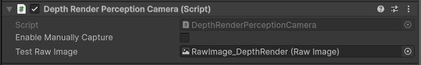


## 集成到ML-Agents

与ML-Agents提供的传感器组件类似, `Perception`提供了对应的传感器组件, 可以直接添加到Agent上. 


### `Bounding Box Component`

用于将Bounding Box信息作为`BufferSensor`观测传递给ML-Agents. 

**配置参数:**

*   `Bounding Box Perception Camera`: 绑定的`Bounding Box Perception Camera`组件. 
*   `Max Number Object`: 最大支持的物体数量, 超过该数量的Bounding Box会被忽略. 
*   `Number Object Type`: 物体类别数量, 应与ID标签配置文件中的类别数量一致, 决定了Bounding Box信息中onehot类别向量的长度, . 
*   `Random`: 域随机化的比例, 以一定概率随机忽略部分Bounding Box或改变Bounding Box的尺寸位置, 模拟传感器噪声, 提升训练鲁棒性. 
*   `Sensor Name`: 传感器名称. 
*   `Image Size`: 传感器图像尺寸, `X` 为width, `Y`为height. 

**Python接收到的observation格式: **

维度为`(Max Number Object, Number Object Type + 4)`的二维数组, `Number Object Type + 4`表示每一个物体的onehot类别向量和Bounding Box信息. 
```
[onehot_id_label_vector..., center_x, center_y, width, height]
```
其中`center_x, center_y, width, height`均为归一化到`[0,1]`范围内的值, 
坐标`(0,0)`为图像的左上角, x轴水平, y轴垂直, 记录的`center_x, center_y, width, height`是bounding box的中心点及宽高. 

如果识别到的物体数量少于`Max Number Object`, 则多余的行会被填充为0. 

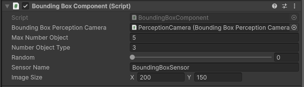

图中例子所生成的observation维度为`(5, 7)`, 表示最多支持5个物体, 类别数量为3（onehot向量长度为3）, 加上4个bounding box信息, 共7维. 

### `Semantic Segmentation Component`

用于将语义分割图像作为`RenderTextureSensor`观测传递给ML-Agents. 

**配置参数:**

*   `Semantic Segmentation Perception Camera`: 绑定的`Semantic Segmentation Perception Camera`组件. 
*   `Random`: 域随机化的比例, 以一定概率随机改变物体的中心位置. 
*   `Sensor Name`: 传感器名称. 
*   `Compression`: 传感器图像压缩格式. 
*   `Image Size`: 传感器图像尺寸, `X` 为width, `Y`为height. 

**Python接收到的observation格式: **

维度为`(3, height, width)`的三通道图像, 每个像素点的RGB值对应语义分割标签配置文件中设置的颜色值. 
三通道全`1`的像素表示背景, 没有识别到任何物体. 

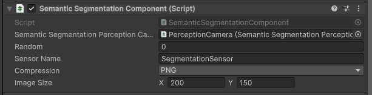

图中例子所生成的observation维度为`(3, 150, 200)`. 

### `Depth Render Component`

用于将深度图像作为`RenderTextureSensor`观测传递给ML-Agents. 

**配置参数:**
*   `Depth Render Perception Camera`: 绑定的`Depth Render Perception Camera`组件. 
*   `Sensor Name`: 传感器名称. 
*   `Compression`: 传感器图像压缩格式. 
*   `Image Size`: 传感器图像尺寸, `X` 为width, `Y`为height. 

**Python接收到的observation格式: **

维度为`(1, height, width)`的一通道图像, 每个像素点为[0,1]范围内的灰度值, 表示深度信息, 0为近裁剪面, 1为远裁剪面. 

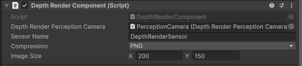

图中例子所生成的observation维度为`(3, 150, 200)`. 


## Python端接收observation

在Python端, ML-Agents会将Perception传感器生成的观测数据作为Agent的观测数据进行接收和处理. 
具体的observation维度和格式请参考上面的各个传感器组件的说明. 

可以参考提供的`Perception_unity_wrapper.ipynb` [Jupyter Notebook](https://github.com/BlueFisher/Perception-for-ML-Agents-Sample/blob/master/Perception_unity_wrapper.ipynb)文件, 了解如何在Python端接收和处理这些观测数据. 

以下是`Perception_unity_wrapper.ipynb`的部分简要示例说明: 

```
{'TestPerceptionAgent?team=0': ['BoundingBoxSensor', 'DepthRenderSensor', 'SegmentationSensor']}
{'TestPerceptionAgent?team=0': [(5, 7), (1, 150, 200), (3, 150, 200)]}
```

表示`TestPerceptionAgent?team=0`这个Agent有3个传感器, 分别是`BoundingBoxSensor`、`DepthRenderSensor`和`SegmentationSensor`, 对应的observation维度分别为`(5, 7)`、`(1, 150, 200)`和`(3, 150, 200)`. 

以下是第3帧的观测数据示例: 

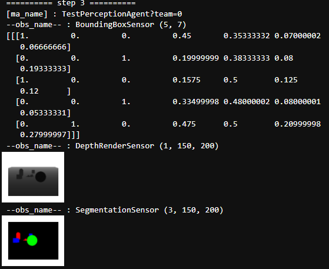